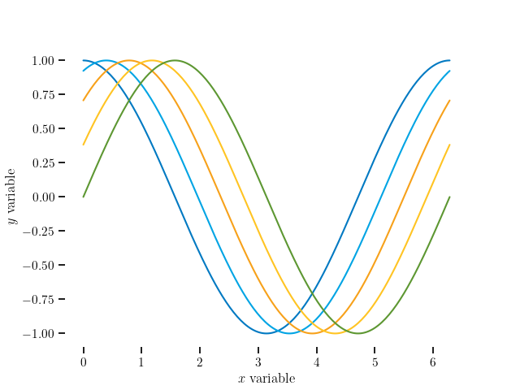

# Cory's plotting library

This repo exists for two reasons:
  1. centralize my common plotting stylesheets and options for uniformity
  2. make scripts to quickly generate common plots, but nice looking

## Stylesheet usage

`plot_cvf` provides a function `get_stylesheets` which gets the stylesheets I
like to use from where they're installed for the system, and returns a list of
sheets to apply based on the provided options, for integration into matplotlib:

```
import matplotlib.pyplot as plt
import plot_cvf

plt.style.use(plot_cvf.get_stylesheets())

... do standard plotting with pyplot ...

```

will result in:



In a pinch, `plot_cvf` is not going to be available, but having this on github
is useful, because pyplot can set a stylesheet based on a URL. Thus, even:
```
import matplotlib.pyplot as plt

url_stylesheet_cvf= "https://github.nrel.gov/raw/cfrontin/plot_cvf/main/plot_cvf/stylesheet_cvf.mplstyle"
url_stylesheet_seaborn= "https://github.nrel.gov/raw/cfrontin/plot_cvf/main/plot_cvf/stylesheet_seaborn.mplstyle"
plt.style.use(['dark_background', '',
                url_stylesheet_seaborn,
                url_stylesheet_cvf])

... do standard plotting with pyplot ...

```
will result in pretty plots:

